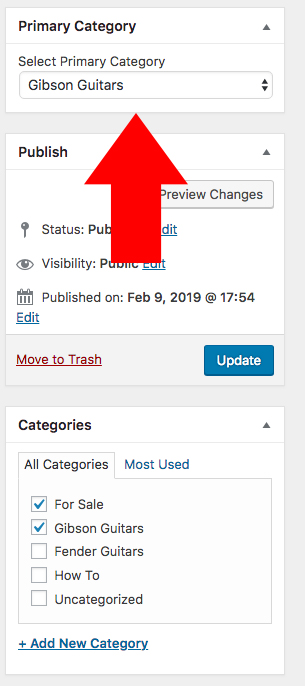
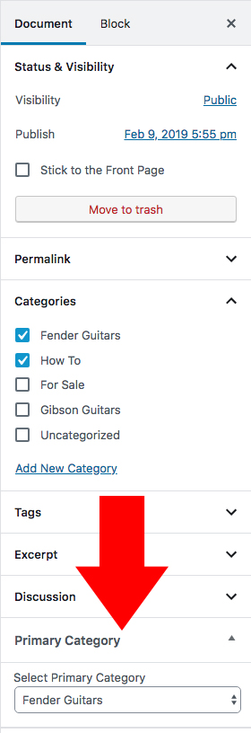

# Primary Category Display
Allows a user to assign a primary category to a post or custom post type.

## Setup
- Install and activate the plugin.
- Assign primary categories to your posts with the dropdown on the post's admin page.
  - Classic Editor:
    - 
  - Gutenberg:
    - 
- You must refresh the page when adding/removing categories to the post. This could also be handled with JavaScript. Please forgive me, I really don't have the time to write that.

## Display
To display the posts in your template, add the following to your-template.php:
- Change `custom_post_type_name` to your custom post type's name.
- Change "Primary Category Name" to your Primary Category.
- Accepts multiple Custom Post Types.
```php
<?php

/**
 * Set query arguments.
 */
$queryArgs = [
    'post_type' => array('post', 'custom_post_type_name'),
    'primary_category' => 'Primary Category Name',
];

/**
 * Return a WP_Query object.
 */
$articles = (new PrimaryCategory\Display($queryArgs))->WPQueryObject();
```

